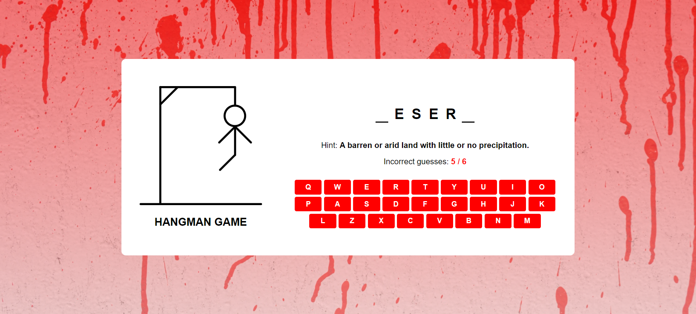

# Hangman Game

This is a Hangman game where users can guess the hidden word by selecting letters either by clicking on the on-screen keyboard or by using their physical keyboard.

## Live Version

You can play the game [here](https://yasseresam.github.io/Hangman-Game-JavaScript/).

## Screenshots

### Game Screen

### Starter Screen

## How to Play

- The objective of the game is to guess the hidden word by selecting letters.
- You can make a maximum of 6 incorrect guesses before the game is over.
- If you guess the word correctly, you win the game!

## Technologies Used

- HTML
- CSS
- JavaScript

## Features

- QWERTY keyboard layout for easy letter selection.
- Visual feedback for correct and incorrect guesses.
- Option to play again after the game is over.

